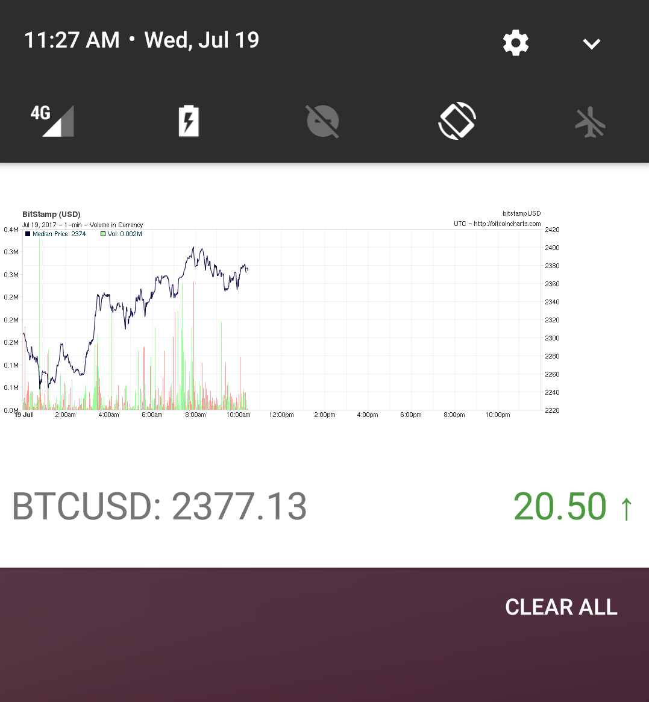

# Making live notification for Android using Pusher

I was fascinated at how the Guardian Media Lab covered the US presidential election last fall. They created what they call a _live notification_. It's a persistent notification that stays in the drawer, and can change each time it receives new data.

They used it to indicate which candidate was winning, and by how many delegates. You can read more about it and how they created it [on their Medium blog](https://medium.com/the-guardian-mobile-innovation-lab/building-the-guardians-live-elections-notifications-87bafbcf510).

Today I will show you how to add something similar to your apps. In this concrete example, we'll be building a notification that shows the movement of the price of BitCoin, Ether, or your favourite cryptocurrency.

The end product will look similar to this:



The technologies we will be using are:

- Android app as the primary user interface
- Firebase Cloud Messaging (FCM) as delivery mechanism for Push notifications
- Pusher Push Notifications service to interact with FCM
- Node.JS for our server component that will orchestrate sending Push notifications
- Cryptocurrency APIs:
   - Bitstamp for raw data,
   - and BitcoinCharts for the charts in image format

This tutorial assumes you're familiar with the basics of Android and JavaScript/Node.js, and that you have accounts on Pusher and Firebase. If not, I'll wait. Chop, chop.
The full source code for both the server and client projects can be found in this repository: https://github.com/pusher/LiveCryptocurrencyNotifications

## Setup

To set up Pusher and FCM in your project initially you can follow the step-by-step tutorial on [Pusher's documentation](https://pusher.com/docs/push_notifications/android/client_fcm).
Once you have that up and running, there's a few things we'll do to make it work:

- Set up the server component that sends the pushes at a regular interval
- Add Glide library for loading images 🛫
- Implement a custom `FirebaseMessagingService` 🚀
- Create the View for displaying the notification 👀
- Tie everything together 🎁

### Sending the notification

FCM allows us to specify 2 types of payloads - `notification` and `data`. They differ in how a push notification is handled when the application is not in the foreground.
Using the `notification` payload requires less work, as Android will automatically show the notification if a push is received when the application is not currently in the foreground.
The `data` payload gives us more freedom in showing the notification, and allows us to style it to our liking. That is the one we will use. You can read more about their differences on FCM documentation: https://firebase.google.com/docs/cloud-messaging/concept-options

The `data` payload takes any combination of primitive key/values. On the device we'll get them as an Android `Bundle` object using `remoteMessage.getData()`.
Our sample bundle could look like this:

```javascript
let payload = {
  graphUrl: "http://www.example.com/path/to/graph.png",
  currentPrice: "2387.88",
  openPrice: "2371.22",
  currencyPair: "BTCUSD"
}
```

As I mentioned, we will get the data from two sources - the current price data from [Bitstamp's API](https://www.bitstamp.net/api/), as well as an image of the current price chart - from [BitcoinCharts](https://bitcoincharts.com/charts/bitstampUSD#rg1zig15-minztgMzm1g10zm2g25zv).

The current ticker value can be found here: https://www.bitstamp.net/api/v2/ticker_hour/btcusd/.

To get the image from BitcoinCharts we'll need to be a bit clever and inspect the element with the image in our browser to get it's URL. With the interval set top 15 minutes the chart's URL looks like this:
https://bitcoincharts.com/charts/chart.png?width=940&m=bitstampUSD&SubmitButton=Draw&r=1&i=15-min&c=0&s=&e=&Prev=&Next=&t=W&b=&a1=&m1=10&a2=&m2=25&x=0&i1=&i2=&i3=&i4=&v=1&cv=1&ps=0&l=0&p=0&


To get the latest price data we can use the `sync-request` Node library. Making the request synchronously is fine as we are making them on an one-by-one basis.

```javascript
const request = require('sync-request');
let btcprice = JSON.parse(request('GET', 'https://www.bitstamp.net/api/v2/ticker_hour/btcusd/').getBody('utf8'));
let currentPrice = btcprice.last;
let openPrice = btcprice.open;
```

Now we need to send this as a Push to FCM, using the `data` payload.

```javascript
const Pusher = require('pusher');
const pusher = new Pusher({
    appId: '[APP_ID]', //Get these from your Pusher dashboard
    key: '[KEY]', //Get these from your Pusher dashboard
    secret: '[SECRET]', //Get these from your Pusher dashboard
});

pusher.notify(['BTCUSD'], {
  fcm: {
    data: payload //We defined the payload above
  }
});
```

Last thing to do is to make this run not in an one-of, but as a recurring cron job instead. To do that we can wrap our `notify` call in a function called `updatePrice` and use the `node-cron` library to schedule it:

```javascript
const cron = require('node-cron');

const updatePrice = () => {
  let btcprice = JSON.parse(request('GET', 'https://www.bitstamp.net/api/v2/ticker_hour/btcusd/').getBody('utf8'));
    let currentPrice = btcprice.last;
    let openPrice = btcprice.open;
    let currencyPair = "BTCUSD";

    let payload = {
      graphUrl: "https://bitcoincharts.com/charts/chart.png?width=940&m=bitstampUSD&SubmitButton=Draw&r=1&i=15-min&c=0&s=&e=&Prev=&Next=&t=W&b=&a1=&m1=10&a2=&m2=25&x=0&i1=&i2=&i3=&i4=&v=1&cv=1&ps=0&l=0&p=0&",
      currentPrice: currentPrice,
      openPrice: openPrice,
      currencyPair: currencyPair
    }

    pusher.notify([currencyPair], {
        fcm: {
            data: {
                graphUrl: graph_url_minute,
                currentPrice: currentPrice,
                openPrice: openPrice,
                currencyPair: currencyPair,
                counter: counter
            }
        }
    });
}

//This will run every 15 minutes
var task = cron.schedule('*/15 * * * *', () => {
    updatePrice();
});
```

We can then run it via the standard `node index.js` command.

### Implementing the client

If you followed the Pusher quick start guide to setting up push notifications you'll have a simple app that subscribes to an interest. It assumes you use the built in `FCMMessagingService` and attach a listener using `nativePusher.setFCMListener(...)`. This is perfectly fine if you use the `notification` FCM payload, as the background pushes will be handled and displayed as notifications by the system. Notifications will also stack one after the other.

For live notifications that technique will not work unfortunately. We want more freedom in displaying the notifications, and we want to reuse existing notification to show updates.
We need to implement our own `FirebaseMessagingService`.

In the AndroidManifest replace the `FCMMessagingService` declaration with the new one (I called it `CryptoNotificationsService`):

```xml
<service android:name=".CryptoNotificationsService">
    <intent-filter>
        <action android:name="com.google.firebase.MESSAGING_EVENT"/>
    </intent-filter>
</service>
```

We also need to create its class to extend FirebaseMessagingService and implement its `onMessageReceived` method:

```java
public class CryptoNotificationsService extends FirebaseMessagingService {

    @Override
    public void onMessageReceived(RemoteMessage remoteMessage) {
      ...
    }
}
```

This is where we'll consume the data from the push payload, use it to and build the notification object from it and show in in a custom view. We can get the data from the `remoteMessage` - the keys will be named the same as we named them in our FCM payload:

```java
Map<String, String> data = remoteMessage.getData();
String graphUrl = data.get("graph_url");
String currentPrice = data.get("currentPrice");
String openPrice = data.get("openPrice");
String currencyPair = data.get("currencyPair");
```

It's now time to display the data in a notification. With the `data` payload we're handling the notification ourselves. Create a new `View` layout and make it include one `ImageView` for the chart, and two `TextViews` for the price data. Everything will be wrapped in a simple `RelativeLayout`. The layout size is limited to what Android notification tray limits - so `256dp`. I called it `notification_view`:

```xml
<RelativeLayout
    xmlns:android="http://schemas.android.com/apk/res/android"
    android:layout_width="match_parent"
    android:layout_height="256dp">

    <ImageView
        android:id="@+id/chart_img"
        android:layout_width="wrap_content"
        android:layout_height="192dp"
        />

    <TextView
        android:id="@+id/price_text"
        android:layout_width="wrap_content"
        android:layout_height="wrap_content"
        android:textSize="24sp"
        android:layout_below="@id/chart_img"
        android:layout_alignParentStart="true"
        android:padding="8dp"
        />

    <TextView
        android:id="@+id/price_difference_text"
        android:layout_width="wrap_content"
        android:layout_height="wrap_content"
        android:layout_below="@id/chart_img"
        android:textSize="24sp"
        android:padding="8dp"
        android:layout_alignParentEnd="true"
        />

</RelativeLayout>
```

To inflate the layout in a notification context we'll use `RemoteViews`. This is a construct that allows to create views outside of the parent process.
Besides notifications, we can also use them to create the home screen Widgets.
On a `RemoteViews` object we can call methods such as `setTextViewText` and `setTextColor`


```java
RemoteViews notificationViews = new RemoteViews(getApplicationContext().getPackageName(), R.layout.notification_view);
notificationViews.setTextViewText(R.id.price_text, String.format("%s: %s", currencyPair, currentPrice));

//Some simple view styling:
String arrow = "↑";
if(difference > 0) {
   notificationViews.setTextColor(R.id.price_difference_text, getColor(R.color.green));
}
else if(difference == 0){
    notificationViews.setTextColor(R.id.price_difference_text, getColor(R.color.black));
    arrow = "";
}
else{
    notificationViews.setTextColor(R.id.price_difference_text, getColor(R.color.red));
    arrow = "↓";
}
notificationViews.setTextViewText(R.id.price_difference_text, String.format("%.2f %s", difference, arrow));
```       

Now that our view is inflated with some data, we can create and display our `Notification` object. For that we'll use the `NotificationCompat.Builder`, and call `setCustomBitContentView` with the `RemoteViews` object from the previous step. Also take note of the notificationId. This ensures we will reuse the same notification each time a new push notification gives us new data. Finally we display the notification with the `notifiy` call on the `notificationManager` passing in the ID and notification object itself:

```java
int notificationId = 1;
Notification notification = new NotificationCompat.Builder(this)
        .setSmallIcon(R.drawable.ic_show_chart_black_24px)
        .setCustomBigContentView(notificationViews)
        .build();


NotificationManager notificationManager =
        (NotificationManager) getSystemService(NOTIFICATION_SERVICE);
notificationManager.notify(notificationId, notification);
```

Now that we have created a notification with the data, we also need an image.

Glide is an excellent tool for that. It allows loading images in a `RemoteViews` object. First, add the library to your `app/build.gradle` dependencies. At the time of this writing the latest version of Glide is `4.0.0-RC1`.

```groovy
compile 'com.github.bumptech.glide:glide:4.0.0-RC1'
annotationProcessor 'com.github.bumptech.glide:compiler:4.0.0-RC1'
```

Glide has the concept of `NotificationTarget` where you specify the `RemoteViews` object and the view ID of an `ImageView` contained in it. It will then load the image using that target.
We'll load the image from an URL we get in the notification. Note that you might also need to call `clearDiskCache` to clear the image from the cache - in case it has the same hostname and path as the previous image. This will make it always fetch the new image.
Last thing to note is that a call to `Glide.load` needs to happen on the main thread. As a push is received outside of the main thread we'll need to ensure we call it there.
That's where the `new Handler(Looper.getMainLooper()).post(...)` comes to play.

```java
final NotificationTarget notificationTarget = new NotificationTarget(
                this,
                R.id.chart_img,
                stockViews,
                notification,
                1);

final Uri uri = Uri.parse(graphUrl);
Glide.get(getApplicationContext()).clearDiskCache();

new Handler(Looper.getMainLooper()).post(new Runnable() {
    @Override
    public void run() {
        Glide.get(getApplicationContext()).clearMemory();
        Glide.with( getApplicationContext() )
                .asBitmap()
                .load(uri)
                .into( notificationTarget );
    }
});
```

The final thing to do is to subscribe to our interest with Pusher. We named it "BTCUSD".

```java
final PusherAndroid pusher = new PusherAndroid("[PUSHER_KEY]");
PushNotificationRegistration nativePusher = pusher.nativePusher();
try {
nativePusher.registerFCM(this);
nativePusher.subscribe("BTCUSD");

} catch (ManifestValidator.InvalidManifestException e) {
e.printStackTrace();
}
```

And we're done! After running the app we can see the notifications being shown on the devices and the BitCoin price updating every 15 minutes. 🎉
