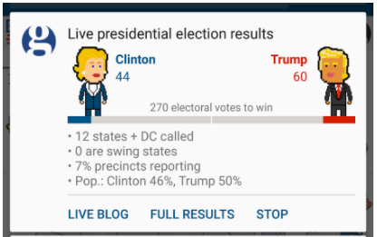

# Making live notification for Android using Pusher

## Preface

- Guardian style
- Cryptocurrencies
- Notifications in Android
- FCM

I was fascinated at how the Guardian Media Lab covered the US presidential election last fall. They created what they call a _live notification_. It's a persistent notification that stayed in the drawer, and could change based on the data it received.

They used it to indicate which candidate was winning, and by how many delegates. You can read more about it and how they created it [on their Medium blog](https://medium.com/the-guardian-mobile-innovation-lab/building-the-guardians-live-elections-notifications-87bafbcf510).

<!--  -->


I will show you how to add something similar to your apps.
In this example, we'll be building a notification that shows the movement of the price of Bitcoin, Ether, or your favourite cryptocurrency.

The end product will look similar to this:

<!-- TODO: screenshot of the notification -->


The technologies we will be using are:

- Android app as the primary user interface
- Firebase Cloud Messaging (FCM) as delivery mechanism for Push notifications
- Pusher Push Notifications service to interact with FCM
- Node.JS for our server component that will orchestrate sending Push notifications
- Cryptocurrency APIs:
   - Bitstamp for raw data,
   - and BitcoinCharts for the charts in image format

This tutorial assumes you're familiar with the basics of development, including Android and Node.js.
You need to already have a Pusher account set up. If not, I'll wait. Chop, chop.


## Setup

### Setting up FCM

We need to have FCM configured and set up in our application in order to be able to receive anything.
If you don't have it in your app already, go to [Firebase Console](https://console.firebase.google.com) and create a project, and follow the instruction to set up your application.
It's important to ensure you package name or application ID matches the one in the console. Then generate the file `google-services.json`.


### Android client

Link to follow: https://firebase.google.com/docs/android/setup

Copy the `google-services.json` from the Firebase console into your Android project directory. Then set up the dependencies for Firebase. It involves adding the line `apply plugin: 'com.google.gms.google-services'` to the end of your `app/build.gradle` file.

Next, add two more SDKs: Pusher for orchestrating with FCM, and Glide for loading images. The lines to add to your dependencies are:

```groovy
dependencies {
  compile 'com.github.bumptech.glide:glide:4.0.0-RC1'
  compile 'com.android.support:support-v4:25.3.1'
  annotationProcessor 'com.github.bumptech.glide:compiler:4.0.0-RC1'
  ...
}
```


### Pusher dashboard


### FCM


### Server component (Node)


- Setup the app
- Setup Pusher
- Data source:
 - bitstamp
 - the thingy that generates our images

## Implementation

### Notification payload

FCM allows us to specify 2 types of payloads - `notification` and `data`. They differ in how a push notification is handled when the application is not in the foreground.
Using the `notification` payload requires less work, as Android will automatically show the notification if a push is received when the application is not currently in the foreground.
The `data` payload gives us more freedom in showing the notification, and allows us to style it to our liking. That is the one we will use.
It can take any combination of primitive key/values you with - you'll have to know the keys in advance though, to get them from the Notification bundle. Our sample bundle could look like this:

```javascript
payload = {
  fcm: {
    data: {
        graph_url: graph_url_minute,
        price: currentPrice,
        open: openPrice,
        trend: trend,
        lowPrice: lowPrice,
        highPrice: highPrice
      }
  }
};
```

As I mentioned, we will get the data from two sources - the current price data from [Bitstamp's API](), as well as an image of the current price chart - from [BitcoinCharts]().

The current ticker value can be found here: https://www.bitstamp.net/api/v2/ticker_hour/btcusd/

To get the image from BitcoinCharts we'll need to be a bit clever and inspect the element with the image in our browser to get it's URL. With the interval set top 15 minutes the chart's URL looks like this:
https://bitcoincharts.com/charts/chart.png?width=940&m=bitstampUSD&SubmitButton=Draw&r=1&i=15-min&c=0&s=&e=&Prev=&Next=&t=W&b=&a1=&m1=10&a2=&m2=25&x=0&i1=&i2=&i3=&i4=&v=1&cv=1&ps=0&l=0&p=0&

Sending a push to devices that subscribe to an interest can be done like this:

```javascript
const Pusher = require('pusher');
const request = require('sync-request');

var pusher = new Pusher({
    appId: '[APP_ID]', //Get these from your Pusher dashboard
    key: '[KEY]', //Get these from your Pusher dashboard
    secret: '[SECRET]', //Get these from your Pusher dashboard
});
pusher.notify(['bitcoin'], payload); //see example payload above
```


### Handing the payload in the app

To handle push notification in the app we need a service with the appropriate Intent Filter. If you followed the instructions in the Pusher documentation they tell you to register two services in your AndroidManifest:

```xml
<service android:name="com.pusher.android.notifications.fcm.FCMMessagingService">
    <intent-filter>
        <action android:name="com.google.firebase.MESSAGING_EVENT"/>
    </intent-filter>
</service>

<service android:name="com.pusher.android.notifications.fcm.FCMInstanceIDService">
    <intent-filter>
        <action android:name="com.google.firebase.INSTANCE_ID_EVENT"/>
    </intent-filter>
</service>
```

That is fine as long as you're handling the pushes when your app is open. For our purpose however, we'll create a new `Service`. First, remove the `FCMInstanceIDService` entry from the manifest, and replace it with another service, like `CryptoNotificationsService`:

```xml
<service android:name=".CryptoNotificationsService">
    <intent-filter>
        <action android:name="com.google.firebase.MESSAGING_EVENT"/>
    </intent-filter>
</service>
```

We need our new service to extend FirebaseMessagingService and implement its `onMessageReceived` method:

```java
public class CryptoNotificationsService extends FirebaseMessagingService {

    @Override
    public void onMessageReceived(RemoteMessage remoteMessage) {
      ...
    }
}
```

This is where we'll consume the data from the push payload, use it to and build the notification object from it and show in in a custom view. The layout of the custom view will include one `ImageView` for the chart, and two `TextViews` for the price data. Everything will be wrapped in a simple `RelativeLayout`. The layout size is limited to what Android notification tray limits - so `256dp`.

```xml
<RelativeLayout
    xmlns:android="http://schemas.android.com/apk/res/android"
    android:layout_width="match_parent"
    android:layout_height="256dp">

    <ImageView
        android:id="@+id/chart_img"
        android:layout_width="wrap_content"
        android:layout_height="200dp" />

    <TextView
        android:id="@+id/price_text"
        android:layout_width="wrap_content"
        android:layout_height="32dp"
        android:textSize="24sp"
        android:layout_below="@id/chart_img" />

    <TextView
      android:id="@+id/price_difference_text"
      android:layout_width="wrap_content"
      android:layout_height="wrap_content"
      android:layout_below="@id/chart_img"
      android:layout_toEndOf="@id/price_text" />

</RelativeLayout>
```

To inflate the layout in a notification context we'll use `RemoteViews`. This is a construct that allows to create views outside of the parent process.
Besides notifications, we can also use them to create the home screen Widgets.
On a `RemoteViews` object we can call methods such as `setTextViewText` and `setTextColor`


TODO: change This

```java
RemoteViews stockViews = new RemoteViews(getApplicationContext().getPackageName(), R.layout.stocks_view);

       String chartEmoji = Integer.parseInt(trend) >= 0 ? "\uD83D\uDCC8" : "\uD83D\uDCC9";
       stockViews.setTextViewText(R.id.price_text, String.format("BTC price - $%s %s", currentPrice, chartEmoji));

       stockViews.setTextColor(R.id.price_text, getTextColour(trend));
       stockViews.setTextViewText(R.id.price_difference_text, String.format("High: $%s | Low: $%s | Open: $%s", highPrice, lowPrice, openPrice));
```       

We can now create our `Notification` object. For that we'll use the `NotificationCompat.Builder`, and call `setCustomBitContentView` with the `RemoteViews` object from the previous step. Also take note of the notificationId. This ensures we will reuse the same notification each time a new push notification gives us new data.

```java
int notificationId = 1;
Notification notification = new NotificationCompat.Builder(this)
        .setSmallIcon(R.drawable.ic_show_chart_black_24px)
        .setCustomBigContentView(stockViews)
        .build();


NotificationManager notificationManager =
        (NotificationManager) getSystemService(NOTIFICATION_SERVICE);
notificationManager.notify(notificationId, notification);
```

Now we have created a notification, but it has only the data to show for it. We also need an image. Glide is an excellent tool for that. It allows you to create a `NotificationTarget` where you specify the `RemoteViews` object and the view ID of an `ImageView` contained in it, and load the image into it. We'll load the image from an URL we get in the notification. Note that you might also need to call `clearDiskCache` to clear the image from the cache - in case it has the same hostname and path as the previous image (in our case). This will make it always fetch the new image.
Last thing to note is that a call to `Glide.load` needs to happen on the main thread. As a push is received outside of the main thread we'll need to ensure we call it there.
That's where the `new Handler(Looper.getMainLooper()).post(...)` comes to play.

```java
final NotificationTarget notificationTarget = new NotificationTarget(
                this,
                R.id.chart_img,
                stockViews,
                notification,
                1);

final Uri uri = Uri.parse(graphUrl);
Glide.get(getApplicationContext()).clearDiskCache();

new Handler(Looper.getMainLooper()).post(new Runnable() {
    @Override
    public void run() {
        Glide.get(getApplicationContext()).clearMemory();
        Glide.with( getApplicationContext() )
                .asBitmap()
                .load(uri)
                .into( notificationTarget );
    }
});
```

The final thing to do is to register our phone with Pusher and subscribe to our interest. In our case, this will be the movement of the "BTC_USD" currency pair.
You can do it in your MainActivity:

```java
final PusherAndroid pusher = new PusherAndroid("[PUSHER_KEY]");
PushNotificationRegistration nativePusher = pusher.nativePusher();
try {
nativePusher.registerFCM(this);
nativePusher.subscribe("BTC_USD");

} catch (ManifestValidator.InvalidManifestException e) {
e.printStackTrace();
}
```

The end result will be


- ...

## Further reading

---

### images

- guardian live
- bitcoin price
- end product
- gif that changes? :o

### Source code

- notification - gui
- notification - impl
- node server component
